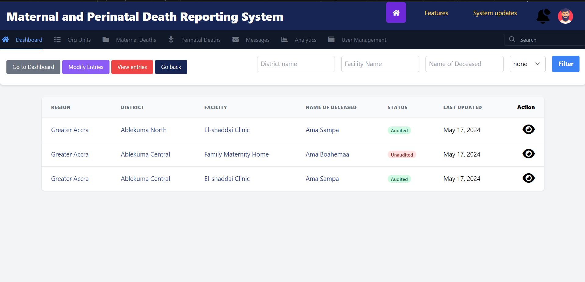

# Maternal Death Tracking System

This is a Django-based web application for tracking maternal deaths. The application allows users to view, filter, and manage entries of maternal deaths in different regions, districts, and facilities.

## Table of Contents

- [Features](#features)
- [Technologies Used](#technologies-used)
- [Setup](#setup)
- [Usage](#usage)
- [Contributing](#contributing)
- [License](#license)

## Features

- View a list of maternal deaths
- Filter entries based on district name, facility name, deceased person's name, and audit status
- Manage (create, update, delete) maternal death entries
- Navigate between different sections with a user-friendly interface
- Display success messages using SweetAlert

## Technologies Used

- **Frontend**: HTML, CSS, Tailwind CSS, JavaScript
- **Backend**: Django, SQLite (default) or any other preferred database
- **JavaScript Libraries**: SweetAlert2

## Setup

### Prerequisites

- Python 3.6+
- Django 3.2+
- Virtualenv (optional but recommended)

### Installation

1. Clone the repository:

   ```bash
   git clone https://github.com/your-username/maternal-death-tracking.git
   cd maternal-death-tracking
   ```

2. Create and activate a virtual environment:

   ```bash
   python -m venv venv
   source venv/bin/activate  # On Windows, use `venv\Scripts\activate`
   ```

3. Install the required packages:

   ```bash
   pip install -r requirements.txt
   ```

4. Apply migrations:

   ```bash
   python manage.py makemigrations
   python manage.py migrate
   ```

5. Create a superuser to access the Django admin:

   ```bash
   python manage.py createsuperuser
   ```

6. Run the development server:

   ```bash
   python manage.py runserver
   ```

7. Access the application at `http://127.0.0.1:8000/`.

## Usage

### Accessing the Dashboard

1. Navigate to the dashboard using the link provided in the navigation bar.
2. Use the filter form to search for maternal death entries based on different criteria.

### Managing Entries

1. Log in to the Django admin at `http://127.0.0.1:8000/admin/` using your superuser credentials.
2. Add, update, or delete entries for maternal deaths, facilities, districts, and regions.

### Filtering Entries

1. Enter the desired criteria in the filter form on the dashboard.
2. Click the "Filter" button to view the filtered results.

## Contributing

1. Fork the repository.
2. Create a new branch (`git checkout -b feature-branch`).
3. Make your changes and commit them (`git commit -m 'Add new feature'`).
4. Push to the branch (`git push origin feature-branch`).
5. Create a new Pull Request.

## License

This project is licensed under the MIT License. See the [LICENSE](LICENSE) file for details.

## Dashboard UI


## Org unit UI


## Maternal deaths entered (view all) UI


